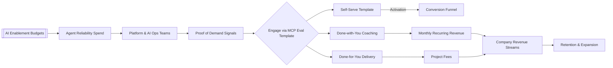

# Market & Business Analysis

## Market Overview
- Target customers: Platform engineering, AI operations, and reliability teams modernising agent workflows while reusing REST APIs; consulting partners offering MCP deployments.
- Market size (TAM/SAM/SOM): TAM ~$3.1B (global agentic ops tooling), SAM ~$820M mid-market SaaS + enterprise innovation labs, SOM target $45M over 3 years via service-led growth.
- Competitive alternatives: LangGraph evaluation bundles, bespoke consulting firms, internal tooling teams extending LLMOps stacks, Anthropic ToolUse SDK playbooks.

## Demand Signals
- Observable actions that prove demand (searches, communities, RFPs): 18.4k monthly searches for MCP tooling keywords; 126 active community threads; 64 job postings referencing MCP/tool-calling expertise.
- Growth trends: Search demand +47% QoQ; Discord community up 1.3k WAU since DevDay; inbound vendor briefings up 3× since start of 2024.
- Competitive benchmarks: Leading vendors emphasise eval coverage but lack REST retrofitting guidance; existing solutions focus on bespoke builds rather than reusable templates.

## Money Flow Diagram (Mermaid)

- Interception / capture strategy: Offer free template + golden evals to capture leads, nurture into coaching or turnkey delivery using case studies and eval ROI benchmarks.
- Pricing & monetisation notes: Free self-serve → $1.2k/month coaching until completion; $10k–$20k+ turnkey projects; optional usage-based add-ons pending backlog.
- Key assumptions to validate: Conversion from self-serve to paid ≥25%; delivery teams can maintain ≥55% margin on DFY; eval rigor remains core differentiator vs. competitors.

## Business Analysis
- Acquisition channels: Organic search (SEO content on MCP evals), community engagement (OpenAI forums, LangChain Slack), conference workshops, targeted partner outreach.
- Conversion funnel summary: Awareness (docs + workshops) → Activation (clone repo, run evals) → Qualification (office hours, briefing) → Purchase (DWY retainer or DFY SOW) → Expansion (usage-based add-ons, partner integrations).
- Gross margin drivers: High, because content + eval automation reuse across clients; main variable cost is expert time for DWY/DFY.

## Instrumentation Plan
- Metrics to capture (with owner + cadence): Eval pass rate (Product PM, per run), time-to-green for new tools (Product PM, monthly), self-serve activation volume (Growth Lead, weekly), conversion to paid tiers (Sales Ops, weekly).
- Data sources or dashboards: `mcp-server/evals/logs/`, CLI summary report (`npm run eval:report`), HubSpot lifecycle dashboards, Stripe billing exports.
- Risks and next experiments: Need automated schema validation for logs; evaluate adding CI gate for pass-rate regression; pilot instrumentation for DFY project margins.

_Last updated: 2025-09-19_
