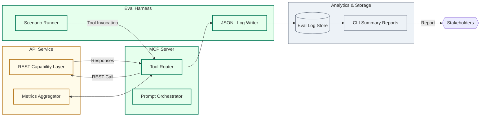

# Product Requirements Document

## Opportunity
- Customer problem: Teams lack a repeatable path to expose REST APIs via MCP while proving tool-call correctness before production launches.
- Business impact: Accelerates agentic initiatives, opens upsell paths (coaching, turnkey delivery), and positions us as the evaluation authority for MCP deployments.
- Success metric: 35 organisations running golden eval scenarios by Q3 2024; 25% conversion from self-serve to paid guidance.

## Money Flow Summary
- Revenue sources: Self-serve (free lead source), done-with-you coaching at $1.2k/month, done-for-you projects $10k–$20k+ per engagement, optional usage-based overages post-MVP.
- Cost structure: Expert hours for coaching/delivery, infrastructure for eval automation (~$0.08/run), content upkeep (~2 PM hrs/week).
- Guardrails / compliance: Maintain audit trails of eval logs, align with customer data minimisation policies, optional extensions for SOC 2/GDPR when required.

## Data Flow Diagram (C3 Mermaid)

- API capabilities (name, purpose, status):
  - `POST /metrics/fetch` – retrieves analytic metrics for scenarios; status: in design.
  - `POST /reports/summarise` – composes eval summaries for stakeholders; status: planned.
  - `POST /artefacts/upload` – uploads regression diffs to storage; status: planned.
- Data contracts (schemas, retention, privacy): JSON payloads described in `mcp-server/evals/scenarios/`; logs retained 90 days by default; sensitive customer data excluded from eval fixtures.

## Release Scope
| Capability | API Endpoint | Owner | Notes |
|------------|--------------|-------|-------|
| Golden scenario execution | MCP `run_scenario` tool calling `POST /metrics/fetch` | MCP Lead | Includes schema validation and regression diffing |
| Coaching insights export | MCP `export_summary` tool calling `POST /reports/summarise` | Product PM | Generates Markdown briefing for DWY clients |
| Regression artefact storage | MCP `store_regression` tool calling `POST /artefacts/upload` | Backend Lead | Optional until DFY automation required |

## Implementation Notes
- Dependencies: Shared auth module (even if disabled by default), log storage bucket, CLI harness for eval execution.
- Open questions: Do DFY clients require isolated log buckets? Should we add webhook callbacks for long-running evals?
- Rollout strategy: Phase 1 deliver golden scenarios + log summariser; Phase 2 introduce artefact storage; Phase 3 align with partner integrations.

_Last updated: 2025-09-19_
