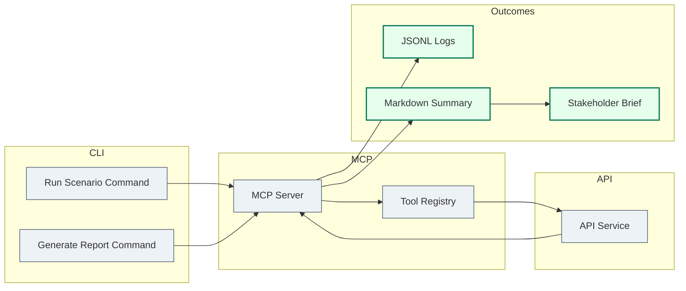

# Experience Blueprint

## Data Flow Reference
Derived from `agent-artifacts/product/prd-data-flow.md`: scenarios trigger MCP tools that call the API service endpoints (`POST /metrics/fetch`, `POST /reports/summarise`, `POST /artefacts/upload`) and write JSONL logs for reporting.

## Entry Points
| URL | Capability | Audience | Notes |
|-----|------------|----------|-------|
| `cli://mcp-eval run --scenario journey_provisioning_happy_path` | Executes golden scenario and stores log | Platform engineers | Default starting point for validation |
| `cli://mcp-eval report --latest` | Generates Markdown summary from logs | Eval leads / stakeholders | Used after each run to brief teams |
| `api://reports/summarise` | Produces briefing for DWY clients | Customer-facing consultants | Invoked via MCP `export_summary` tool |

## Key User Flows (Mermaid C3)

- Success criteria: Scenario runs complete with ≥95% pass rate and produce briefing-ready summaries without manual edits.
- Error / recovery paths: CLI reports non-zero exit on regression; rerun scenario after patch; manual review of regression diffs stored alongside logs.

## Interface Components
| Component | Purpose | Linked Flow | Status |
|-----------|---------|-------------|--------|
| CLI Scenario Runner | Executes scripted MCP conversations | Run scenario | Baseline |
| CLI Report Generator | Produces Markdown summaries | Generate report | Planned |
| Stakeholder Brief Template | Formats key findings for DWY clients | Stakeholder brief | Planned |

## Content & States
- Copy highlights: Communicate pass/fail counts, top regressions, and recommended next steps in report output.
- Empty / loading state expectations: CLI indicates "Running scenario..." with spinner; on first run without logs, report command explains how to execute a scenario first.
- Accessibility considerations: Ensure CLI output supports screen readers and exports are Markdown/plain text for ease of redistribution.

## Handoff Notes
- Analytics events to fire: `eval_run_started`, `eval_run_completed`, `tool_call_mismatch_detected` emitted via log writer.
- Backend capability dependencies: Requires MCP server tools for scenario execution and summary generation; API service endpoints must be reachable.
- Launch checklist: Validate CLI commands across macOS/Linux, ensure log schema matches docs, update documentation screenshots after first successful run.

_Last updated: 2025-09-19_
